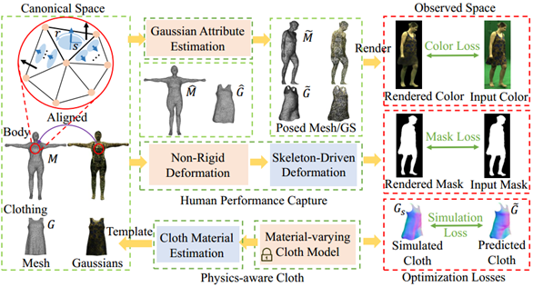

# CloCap-GS: Clothed Human Performance Capture with 3D Gaussian Splatting

### [Project Page](https://wangkangkan.github.io/project_pages/CloCap-GS/index.html) | [Video](https://wangkangkan.github.io/project_pages/CloCap-GS/video/introduction.mp4) | [Paper](#)

> Kangkan Wang*, Chong Wang, Jian Yang, Guofeng Zhang;

Official implementation of Clothed Human Performance Capture with a Double-layer Neural Radiance Fields.
