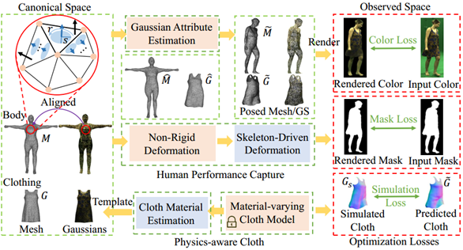

# CloCap-GS: Clothed Human Performance Capture with 3D Gaussian Splatting

### [Project Page](https://wangkangkan.github.io/CloCap-GS/) | [Video](https://wangkangkan.github.io/CloCap-GS/video/introduction.mp4) | [Paper](#)

> Kangkan Wang, Chong Wang, Jian Yang, Guofeng Zhang*;



IEEE Transactions on Image Processing.

# Gaussian-NeRFCap / SuGaR-based Project

Official implementation and usage guide for this project based on Gaussian Splatting and NeRF-style human capture.

Questions and discussions are welcome.

## Installation

### Environment Setup

**Tested on Ubuntu 20.04. CUDA 11.8 is required if you follow the steps below.**

#### Conda Environment

```bash
# Enter project directory
cd gaussian-nerfcap

# Create conda environment
conda env create -f environment.yml

# Activate environment
conda activate gaussian-nerfcap
```

#### Install Gaussian Splatting Dependencies

```bash
# Install Gaussian rasterizer
cd submodules/diff-gaussian-rasterization/
pip install -e .

# If you encounter: fatal error: glm/glm.hpp: No such file or directory
# Please run:
# sudo apt-get install libglm-dev

# Install KNN module
cd ../simple-knn/
pip install -e .

# Return to project root
cd ../../
```

If the above installation method does not work, please refer to the official SuGaR installation guide:
https://github.com/Anttwo/SuGaR?tab=readme-ov-file#2-creating-the-conda-environment

## Run the Code

### Training

```bash
python train_net.py --cfg_file configs/magdalena2.yaml exp_name magdalena resume False

```

### Testing

**A pretrained checkpoint is provided in the repository.  
The corresponding experiment name (exp_name) is shown below:**

```bash
python train_net.py --test --cfg_file configs/magdalena2.yaml exp_name test_codim_template_lap5 resume True
# or
# ./train.sh
```

## FAQ

### 1. Cloth Deformation Blend Weight Computation

Open the notebook:

```
script/compute_cloth_bw.ipynb
```

Set the paths for the SMPL model and the clothing mesh.  
**The SMPL body and clothing mesh must be well aligned.**

Recommended smoothing values:
- Tight-fitting clothes: `smooth = 10`
- Loose clothes: `smooth ≈ 50`

The output file should be named:

```
bw_weight.npy
```

Place this file in the root directory of the dataset.

### 2. Finding Adjacent Edges

Run the notebook:

```
script/get_edges.ipynb
```

Set the clothing mesh path.  
Rename the generated file to:

```
edges_pair.npy
```

and place it in the root directory of the dataset.
